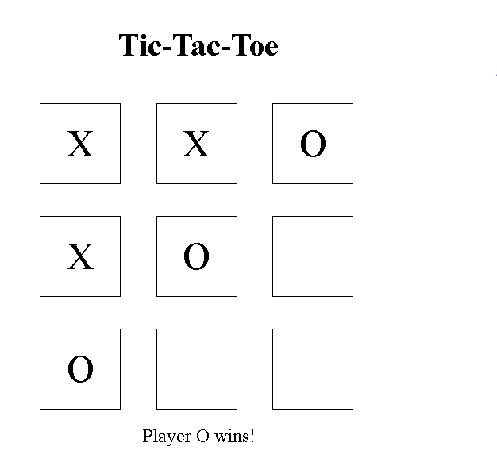

# Tic-Tac-Toe

This is a simple Tic-Tac-Toe game implemented using HTML, CSS, and JavaScript.

## Features

- Allows two players to take turns playing the game.
- Displays the winner when a player wins.
- Declares a tie when there are no more moves left.

## Demo

You can play the game by visiting the [live demo](https://example.com).

## Screenshots




## Getting Started

These instructions will help you get a copy of the project up and running on your local machine.

### Prerequisites

You need a web browser to run the game.

### Installation

1. Clone the repository:

   ```bash
   git clone https://github.com/your-username/tic-tac-toe.git